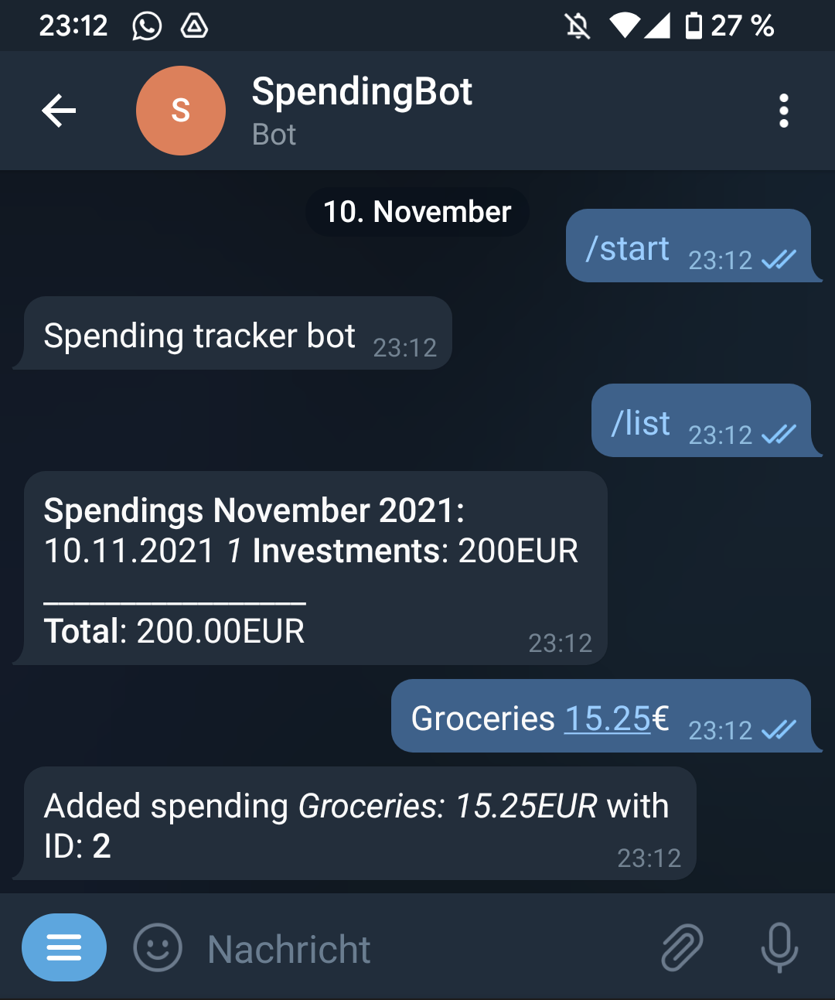

# Telegram Chatbot

This chatbot tracks your spendings in a given month and lists the spent amount of you ask for it.
Currently new spendings can be sent via text messages, however uploading receipts to automatically ingest spendings is planned.

<p align="center">

</p>
  
The bot supports a single user only (the current datamodel does not have a concept of users) + the spendings are free text in the DB.

## Chatbot environment
The Chatbot runs on [Telegram](https://core.telegram.org/bots): https://t.me/BrakidSpendingBot and uses the Golang [telegram-bot-api](https://github.com/go-telegram-bot-api/telegram-bot-api) library to power the bot.

The bot itself uses a [MySQL](https://www.mysql.com) database to store and retrieve spendings and sends them back to the registered user (currently the app supports a single user only. The user is determined by the Chat ID that needs to be set as an environment variable (**TODO: add multiuser support**).
The [Gorm](https://gorm.io/index.html) library is used to map Golang structs to a relational database - Gorm is an [Object-Relational Mapping](https://en.wikipedia.org/wiki/Object%E2%80%93relational_mapping) (ORM) library that supports multiple Relational Database Management Systems (RDBMS) such as MySQL, PostgreSQL or SQLite.

The bot is set up to run in a Docker container: the application uses a [Staged Build](https://docs.docker.com/develop/develop-images/multistage-build/#use-multi-stage-builds) to keep the image size small. The image build first spins up a dedicated builder container to compile the Chatbot application into a single statically-linked executable that then will run on a [Alpine Linux Docker image](https://hub.docker.com/_/alpine). This reduces the memory footprint of the execution image as Golang specific resources (e.g the compiler or runtime environment) are not needed. 

The [Golang Docker image](https://hub.docker.com/_/golang/) takes ~940MB of storage whereas the compiled Chatbot image takes just 13MB. The disadvantage is that the image needs to be rebuilt for different system architectures (e.g x86-64, ARM or ARM64) because of having the compiled application.

## Supported commands:
* ```/list [MM.YYYY]``` - shows all tracked spendings for the given month. If left blank the current month is returned.
* ```/file [MM.YYYY]``` - **NOT IMPLEMENTED YET** returns a file containing all tracked spendings for the given month. If left blank the current month is returned.
* ```/edit <ID> (NAME | AMOUNT)``` - updates an existing spending. You can either change the name or the amount spent
* ```/delete <ID>```- deletes the record
* ```/configure key value```- sets or updates a config value. Currently the only config key in use is: *defaultCurrency*
* ```/show``` - lists all active config values

## Future extensions:
* Receipt uploads to extract spendings (images or PDFs) - [OCR](https://en.wikipedia.org/wiki/Optical_character_recognition)
* Multiuser support - **how to ensure the spending data is kept separate**, encrypt spending data with a per Chat encryption key - [Telegram End-to-End encryption](https://core.telegram.org/api/end-to-end)
* Improved parsing of messages: currently each text message is interpreted as a new spending. Utilize [NLP](https://searchenterpriseai.techtarget.com/definition/natural-language-processing-NLP) to allow for text messages that also request updates or deletions of spending records.
